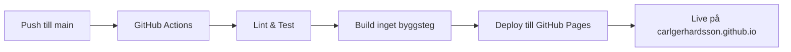

# Arkitektur - Löneportalen

## Översikt

Löneportalen är en single-page application (SPA) byggd med vanilla JavaScript. Arkitekturen är medvetet enkel för att hålla projektet lätt att underhålla utan byggsteg eller ramverk.

## Teknisk stack

| Komponent | Teknologi | Motivering |
|-----------|-----------|------------|
| **Frontend** | Vanilla JavaScript | Ingen build-process, lättare onboarding |
| **Styling** | Tailwind CSS (CDN) | Utility-first, snabb utveckling |
| **State** | localStorage | Persistens utan backend |
| **Rendering** | Template literals | Reaktiv UI utan framework |
| **Deployment** | GitHub Pages | Gratis, enkelt, automatiskt |

## Arkitekturprinciper

### 1. Single-File Architecture
Hela applikationen finns i en enda HTML-fil (`loneportalen.html`). Detta ger:
- ✅ Inga byggsteg eller bundlers
- ✅ Enkel deployment (en fil att ladda upp)
- ✅ Portabilitet (kan köras lokalt utan server)
- ⚠️ Begränsat till ~1000 rader innan det blir ohanterligt

### 2. Functional Reactive Rendering
```javascript
function render() {
  hydrated = hydrateActivities(currentPeriod);
  document.getElementById('app').innerHTML = 
    (!loggedInUser || !USERS[loggedInUser]) 
      ? renderLogin() 
      : renderApp();
}
```

Alla UI-uppdateringar sker via en central `render()`-funktion som:
1. Hydraterar data från localStorage
2. Genererar HTML via template literals
3. Ersätter hela DOM-trädet

**Fördel:** Enkel mental modell, inga virtuella DOM-diffar  
**Nackdel:** Mindre performant vid stora dataset (>100 aktiviteter)

### 3. State Management

#### Global State
```javascript
let loggedInUser        // Inloggad användare
let currentTab          // Aktiv flik (overblick/perioder/verktyg)
let currentPeriod       // Vald månad (YYYY-MM)
let expandedActivities  // Set av expanderade aktiviteter
let selectedActivityId  // Vald aktivitet i Verktygslådan
let periodData          // { "2025-03": { activityId: {...} } }
```

#### localStorage Schema
```javascript
{
  "loneportalen_periodData": {
    "2025-03": {
      "1": {
        "done": false,
        "status": 33,
        "comment": "Saknar FOS-svar för 3 nyanställda",
        "checklist": {
          "101": false,
          "102": true,
          "103": true
        }
      },
      "2": { ... }
    },
    "2025-04": { ... }
  }
}
```

**Separationen mellan aktivitetsmallen och period-state är nyckeln:**
- `activities` = oföränderlig mall (20 POL-aktiviteter)
- `periodData` = föränderlig state per månad
- `hydrateActivities(period)` = sammanfogar mall + state

### 4. Per-Period State

Varje månad har sin egen oberoende status. Detta möjliggör:
- Parallell bearbetning av flera månader
- Historisk återblick (granska Mars efter April är klar)
- Rollback (om Mars blev fel, återställ från tidigare version)

**Flöde:**
```
Användare byter till "2025-04"
  ↓
changePeriod("2025-04")
  ↓
currentPeriod = "2025-04"
  ↓
render() → hydrateActivities("2025-04")
  ↓
Hämtar periodData["2025-04"] från localStorage
  ↓
Applicerar status på activities-mallen
  ↓
Renderar UI med April-data
```

### 5. Aktivitetsstruktur

```javascript
{
  id: 2,                    // Unikt ID
  processNr: '1.2',         // Synligt process-nummer
  phase: 'fore',            // Fas (fore/kontroll/efter)
  name: 'Hantera nyanställningar...',
  person: 'Elif Bylund',    // Ansvarig
  done: false,              // Hel aktivitet klar?
  status: 0,                // Procent (0-100)
  comment: '',              // Fri text
  link: 'LA > Anställningsregister',  // Sökväg i POL
  polRef: 'POL LA s. 128',  // Manualsidangivelse
  inAPI: true,              // Synkas mot backend?
  checklist: [              // Delsteg
    {
      id: 201,
      name: 'Registrera nyanställningar...',
      done: false,
      errorLists: [],       // Fellistor kopplade till detta delsteg
      reports: ['Personlogg']  // Rapporter kopplade till detta delsteg
    }
  ]
}
```

**Viktigt:** `errorLists` och `reports` flyttades från aktivitetsnivå till delstegsnivå i v1.4.0 för att ge mer precision.

### 6. Status-beräkning

**Före v1.2:** Manuell markering (aktivitet.done → status = 100%)

**Från v1.2:** Delsteg-driven
```javascript
function recalcActivity(a) {
  if (a.checklist.length === 0) return; // Inga delsteg → manuell
  const total = a.checklist.length;
  const done  = a.checklist.filter(i => i.done).length;
  a.status = Math.round(done / total * 100);
  a.done   = done === total;  // Klar endast när alla delsteg är klara
}
```

**Total framdrift:**
```javascript
const totalSteps = activities.reduce((s,a) => s + (a.checklist.length || 1), 0);
const doneSteps  = activities.reduce((s,a) => {
  if (a.checklist.length > 0) 
    return s + a.checklist.filter(i=>i.done).length;
  return s + (a.done ? 1 : 0);
}, 0);
const pct = Math.round(doneSteps / totalSteps * 100);
```

Detta ger en mycket mer granulär progress — 67 totala delsteg istället för 20 aktiviteter.

## Data Flow

### Användarinteraktion → State Update

```
Användare bockar delsteg 201
  ↓
toggleChecklist(activityId=2, itemId=201)
  ↓
Hittar hydrated aktivitet med id=2
  ↓
item.done = !item.done
  ↓
recalcActivity(a)  // Räknar om status & done
  ↓
Bygger checklist-map: { 201:true, 202:false, ... }
  ↓
setPeriodActivity(currentPeriod, 2, { done, status, checklist })
  ↓
Uppdaterar periodData["2025-03"]["2"]
  ↓
Sparar till localStorage
  ↓
saveActivityToAPI(a)  // Om API är anslutet
  ↓
render()  // Re-renderar hela UI
```

## Prestanda-överväganden

### Nuvarande begränsningar
- **Re-render hela DOM:** Varje state-ändring triggar fullständig re-render
- **Ingen virtuell DOM:** Innebär mer arbete för webbläsaren
- **Inga optimeringar:** Inga React.memo-motsvarigheter

### Varför det funkar ändå
- **Liten dataset:** 20 aktiviteter, 67 delsteg
- **Låg uppdateringsfrekvens:** Användaren bockar ~1-2 delsteg/minut
- **Ingen realtidsdata:** Ingen polling eller websockets

### Skalbarhetsgräns
Vid >100 aktiviteter eller >500 delsteg bör vi migrera till:
- React + virtuell DOM
- Eller: Granulära DOM-uppdateringar med `querySelector`

## API Integration (Framtida)

```javascript
async function saveActivityToAPI(a) {
  if (apiStatus !== 'connected' || !a.inAPI) return;
  try {
    await fetch(`${API_BASE_URL}/activities/${a.id}`, {
      method: 'PUT',
      headers: { 'Content-Type': 'application/json' },
      body: JSON.stringify({
        id: a.id,
        completed: a.done,
        completion_percentage: a.status,
        comment: a.comment
      })
    });
  } catch (err) {
    console.error('API save failed:', err);
  }
}
```

**5 aktiviteter markerade som `inAPI: true`:**
- 1.2 Hantera nyanställningar
- 1.3 Slutlöner
- 1.5 Fasta tillägg/retroaktivitet
- 1.6 Tillfälliga lönehändelser
- 2.4 Frånvarokontroll

Dessa synkas mot backend när API är tillgängligt.

## Säkerhet

### Nuvarande läge (client-only)
- ✅ Ingen backend = ingen attack surface
- ✅ localStorage är sandboxad per origin
- ⚠️ Ingen autentisering (demo-lösenord i klartext)
- ⚠️ Ingen kryptering av localStorage-data

### När backend introduceras
- [ ] JWT-baserad autentisering
- [ ] HTTPS-only
- [ ] CORS-policy
- [ ] Rate limiting på API
- [ ] Kryptering av känslig data (personnummer i kommentarer?)

## Framtida förbättringar

### Kortsiktiga (v1.6-v1.9)
- [ ] Export/import av data (JSON, Excel)
- [ ] Tidsstämplar på delsteg (auditlogg)
- [ ] Sökfunktion i aktivitetslistan
- [ ] Filter per ansvarig/fas/API-status

### Långsiktiga (v2.0+)
- [ ] Migrera till React + TypeScript
- [ ] Backend-integration (REST API)
- [ ] Realtidssynk mellan användare (WebSockets)
- [ ] Notifikationer/påminnelser (e-post, Slack)
- [ ] POL-chatbot med RAG

## Testning

### Nuvarande (ingen automatiserad testning)
- Manuell QA i Chrome, Firefox, Safari
- Explorativ testning efter varje release

### Framtida
```yaml
# .github/workflows/test.yml
- Playwright E2E-tester
  - Logga in
  - Bocka delsteg
  - Byt period
  - Kontrollera persistens
- ESLint för kodkvalitet
- Lighthouse för prestanda
```

## Deployment



Eftersom vi inte har byggsteg är deployment extremt enkelt — GitHub Pages serverar `src/loneportalen.html` direkt.

## Appendix: Designbeslut

| Beslut | Alternativ | Motivering |
|--------|------------|------------|
| Single-file | Multi-file (HTML/CSS/JS) | Portabilitet, enkel deployment |
| Vanilla JS | React/Vue | Ingen overhead, lätt att lära |
| localStorage | Backend DB | Fungerar offline, ingen server-kostnad |
| Template literals | JSX | Native JS, inget byggsteg |
| Tailwind CDN | Custom CSS | Snabb utveckling, konsekvent design |
| GitHub Pages | Vercel/Netlify | Gratis, integrerat med GitHub |

---

**Skapad:** 2026-02-17  
**Senast uppdaterad:** 2026-02-17  
**Version:** 1.5.0
